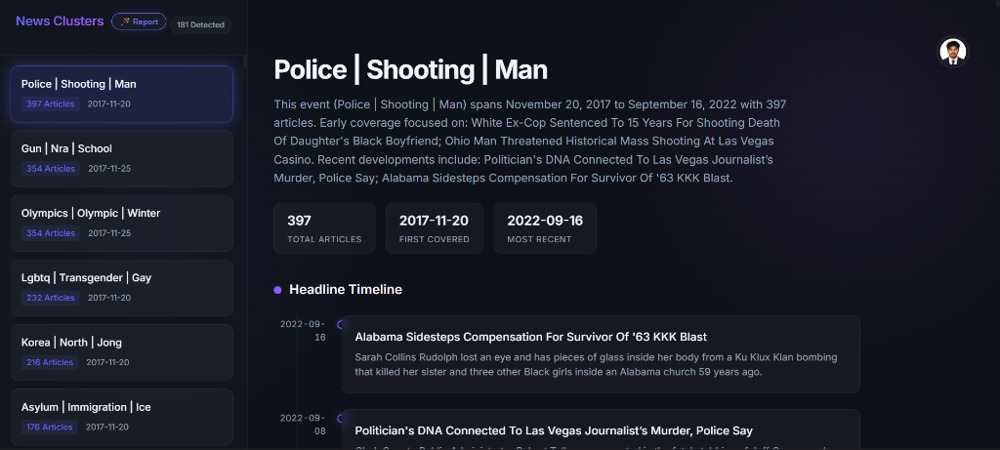
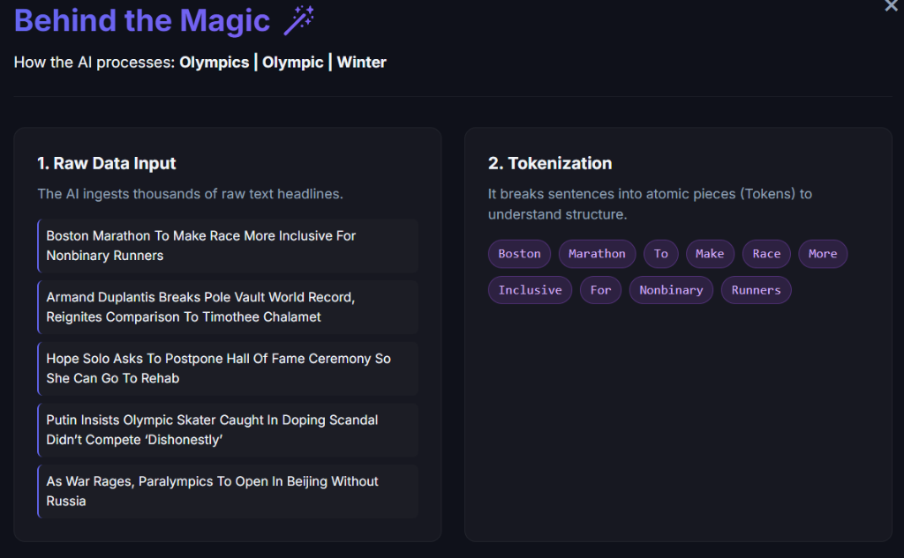
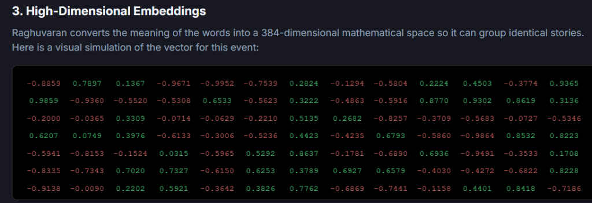
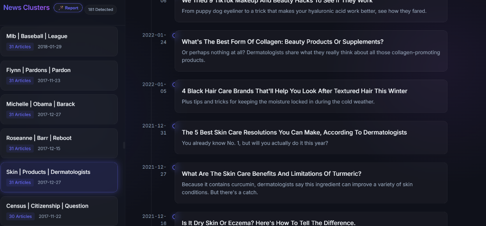
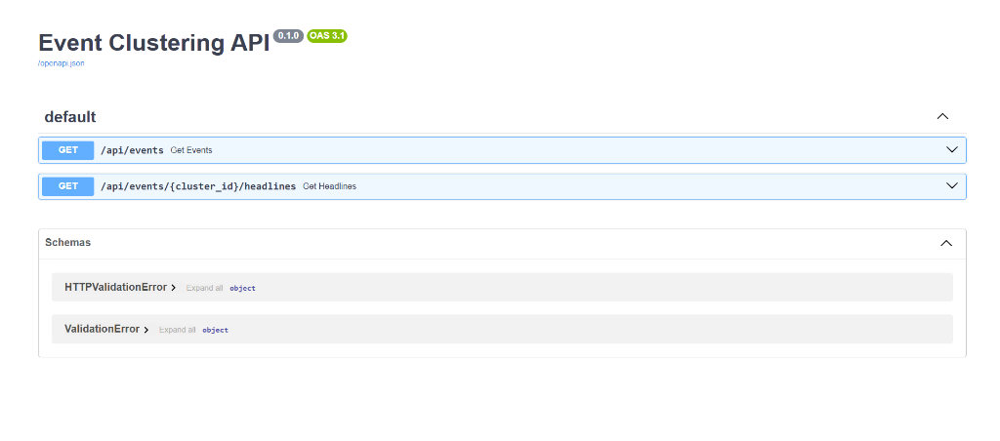
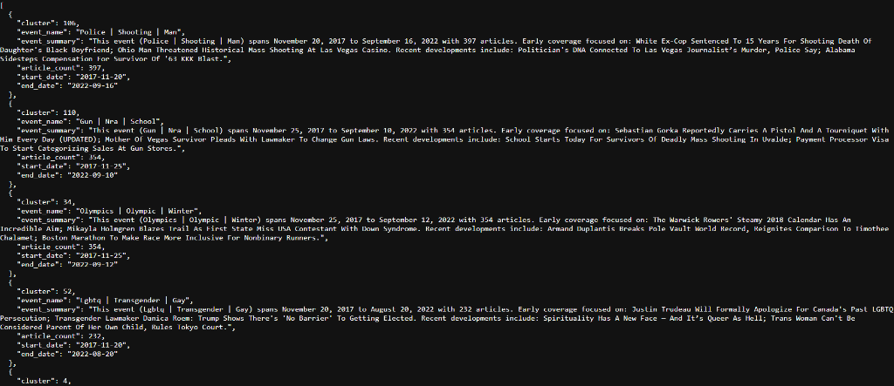

# 📰 News AI: Event Clustering Project

Hey there! Welcome to the Event Clustering project. If you're looking at this and wondering what all these files do, don't worry—I'm going to break it down step-by-step so it makes complete sense, even if you're totally new to machine learning.

Basically, the goal of this project is to take a massive pile of random news articles and automatically group them together into specific real-world "events" (like grouping all the articles about the 2012 Olympics, or a specific election).



## 🚀 How to Run the Project Locally

Want to see it in action? You don't need to run the machine learning notebook again unless you want to generate new data. You just need to start the web app!

### 1. Install Requirements
First, ensure you have the necessary dependencies installed for both the backend and frontend.

**Backend:**
Make sure you are in the `Event Clustering` folder and run:
```bash
pip install -r requirements.txt
```

**Frontend:**
```bash
cd news-ai-frontend
npm install
```

### 2. Start the Servers
You'll need to open two separate terminal windows to run both servers at the same time.

**Terminal 1 (Start the Backend):**
Make sure you are in the main `Event Clustering` folder, and type:
```bash
python main.py
```
*(This starts the Python API server at **http://localhost:8000**)*

**Terminal 2 (Start the Frontend):**
Navigate into the frontend folder and start the UI:
```bash
cd news-ai-frontend
npm run dev
```
*(This starts the web server at **http://localhost:5173**)*

**🎉 You're done!** Open your web browser and go to `http://localhost:5173` to view the beautiful dashboard!

---

## 🧠 How the AI Works (Behind the Magic)

Here is exactly how we built it and how it works behind the scenes.



### Step 1: The Dataset
We started with a huge dataset of news articles called the **News Category Dataset v3**. For our project, we only care about the text itself—specifically the headlines and the short descriptions.

### Step 2: The Machine Learning Pipeline
All the heavy lifting happens inside the `1_News_Clustering_Pipeline.ipynb` Jupyter Notebook. 

1. **Cleaning the Text**: Real-world data is messy. First, we strip out weird punctuation, extra spaces, and special characters.
2. **Understanding the Text (Embeddings)**: Computers don't read English, they read numbers. We use a powerful AI tool called `SentenceTransformer` to read every single cleaned headline and convert its "meaning" into a long list of numbers (called an embedding). Articles with similar meanings get similar numbers.



3. **Compressing the Data (UMAP)**: Those lists of numbers are huge and hard to work with. We use an algorithm called UMAP to compress them down into a much smaller, manageable size while keeping the core meaning intact.
4. **Grouping the Events (HDBSCAN)**: Now that our articles are compressed into little data points, we use a clustering algorithm called HDBSCAN. It looks for tight clumps of data points and groups them together. Each clump represents a specific news event!
5. **Naming the Events (c-TF-IDF)**: Finally, we need to know what each group is actually about. We run a specialized keyword extractor that scans the grouped articles and automatically generates a title for the event based on the most common, unique words used.



When the notebook is finished, it spits out all the answers into a nice, clean file called `Processed_Events.csv`.

---

## 🏗️ The Architecture

The web app is split into two small parts that talk to each other:

**1. The Backend (FastAPI)**
A lightning-fast Python server (`main.py`). Its only job is to read our final `Processed_Events.csv` file and send that data to the internet so our frontend can read it. 

FastAPI automatically generates beautiful interactive API documentation (Swagger UI). When the backend is running, you can visit **http://localhost:8000/docs** to see and test the API directly!



This API returns the raw, clustered news data in a structured JSON format, which the frontend then uses to build the dashboard.



**2. The Frontend (React)**
Inside the `news-ai-frontend` folder is a custom-designed React application. It connects to our Python backend, grabs the data, and displays it in a beautiful, dark-mode dashboard where you can click on different events and read the original headlines.

---

## 👨‍💻 Author
**Created by Raghuvaran**  
GitHub: [raghuvaranlokati](https://github.com/raghuvaranlokati)
